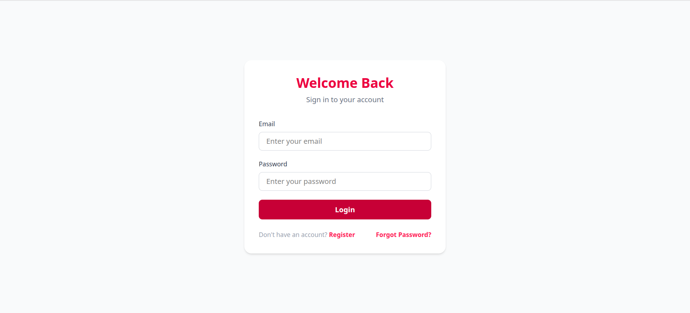
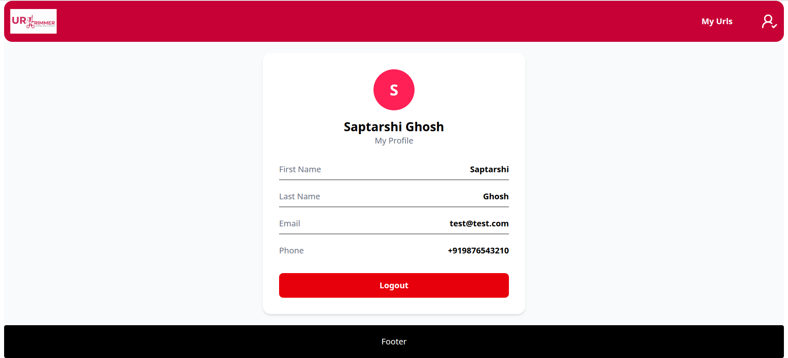
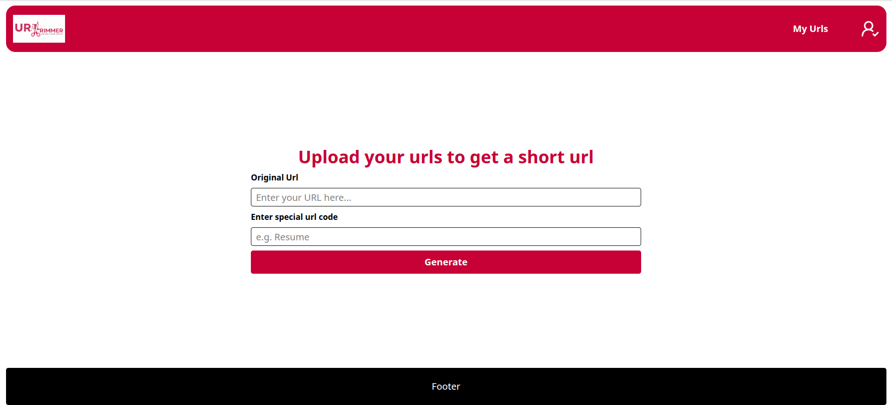
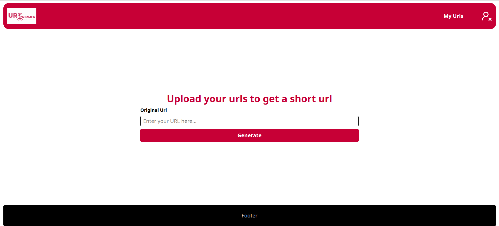

# 🔗 URL Shortener — Backend

A production-oriented **Django REST Framework** backend for creating, managing, and redirecting shortened URLs with **JWT authentication**, **OTP email verification**, **Redis caching**, **Celery background tasks**, and **rate limiting**.

---

## 📸 Screenshots

> Add your frontend screenshots here after deployment.

### Login



### profile



### Create Short URL





---

# ✨ Features

## 🔐 Authentication

- Custom User Model
- User Registration with Email OTP Verification
- OTP delivered asynchronously using Celery
- JWT Authentication (Access & Refresh Tokens)
- Password Reset via Email
- Secure Login using Djoser + SimpleJWT

---

## 🔗 URL Shortening

- Create shortened URLs
- Support for authenticated and anonymous users
- Custom short code support
- Edit original URL (one-time)
- Extend URL expiry
- Fast redirects using Redis caching

---

## ⚡ Rate Limiting

- Anonymous URL creation (Per-IP)
- Authenticated URL creation (Per-User)
- Redirect endpoint rate limiting

---

## 🚀 Background Tasks

Using **Celery + Redis**

- OTP Email Sending
- Password Reset Email
- Automatic cleanup of expired URLs
- Scheduled tasks via Celery Beat
- Flower dashboard for monitoring

---

# 🛠 Tech Stack

| Category | Technology |
|-----------|------------|
| Backend | Django , Django REST Framework |
| Authentication | Djoser, SimpleJWT |
| Database | MySQL |
| Cache | Redis |
| Task Queue | Celery |
| Scheduler | Celery Beat |
| Monitoring | Flower |

---

# 📂 Project Structure

```text
url_shortner_backend/
│
├── accounts/
│   ├── serializers.py
│   ├── views.py
│   ├── tasks.py
│   └── models.py
│
├── urlApp/
│   ├── services/
│   ├── serializers.py
│   ├── views.py
│   └── models.py
│
├── urlshortner/
│   ├── settings.py
│   ├── urls.py
│   └── celery.py
│
└── manage.py
```

---

# ⚙️ Installation

## 1. Clone Repository

```bash
git clone <repository-url>
cd url_shortner_backend
```

---

## 2. Create Virtual Environment

### Linux / macOS

```bash
python -m venv env
source env/bin/activate
```

### Windows

```bash
python -m venv env
env\Scripts\activate
```

---

## 3. Install Dependencies

```bash
pip install -r requirement.txt
```

---

## 4. Configure Environment Variables

Create a `.env` file.

Set env veriables 

---

## 5. Apply Migrations

```bash
python manage.py migrate
```

---

## 6. Start Development Server

```bash
python manage.py runserver
```

---

## 7. Start Celery Worker

```bash
celery -A urlshortner worker --loglevel=info
```

---

## 8. Start Celery Beat

```bash
celery -A urlshortner beat --loglevel=info
```

---

## 9. Start Redis and smtp 

```bash
docker run -d -p 6379:6379 redis 
```

---
## 10. Start Redis and smtp 

```bash
docker run --rm -it -p 5000:80 -p 2525:25 -p 110:110 rnwood/smtp4dev
```

Visit:

```
http://localhost:5000
```

---

# 📡 API Endpoints

## Authentication

| Method | Endpoint | Description |
|--------|----------|-------------|
| POST | `/register/` | Register User |
| POST | `/verify-otp/` | Verify OTP |
| POST | `/auth/jwt/create/` | Login |
| POST | `/auth/jwt/refresh/` | Refresh Access Token |
| POST | `/auth/users/reset_password/` | Send Password Reset Email |
| POST | `/auth/users/reset_password_confirm/` | Reset Password |

---

## URL APIs

| Method | Endpoint | Authentication |
|--------|----------|---------------|
| POST | `/urls/` | Optional |
| GET | `/urls/` | Required |
| PATCH | `/urls/<id>/` | Required |
| DELETE | `/urls/<id>/` | Required |
| GET | `/<short_code>/` | No |

---

# 🖼 Adding Screenshots

Create a folder:

```text
assets/
```

Example:

```text
assets/
├── login.png
├── register.png
├── profile.png
├── forgot-password.png
└── create-url.png
```

Display an image:

```markdown

```

Resize an image:

```html

```

Display two images side-by-side:

```html
<p align="center">
  
  
</p>
```

---

# 🚧 Future Improvements

- user profile
- Custom Domains
- Bulk URL Shortening
- URL Expiration Notifications
- Docker Deployment
- GitHub Actions CI/CD
- Kubernetes Deployment

---

# ⚠ Known Limitations

- Click count fields exist but are not yet integrated into redirect logic.
- Djoser's default `/auth/users/` endpoint is intentionally unused in favor of the custom registration + OTP flow.

---

# 👨‍💻 Author

**Saptarshi Ghosh**

Full stack Developer | Django REST Framework | React | Redis | Celery | MySQL